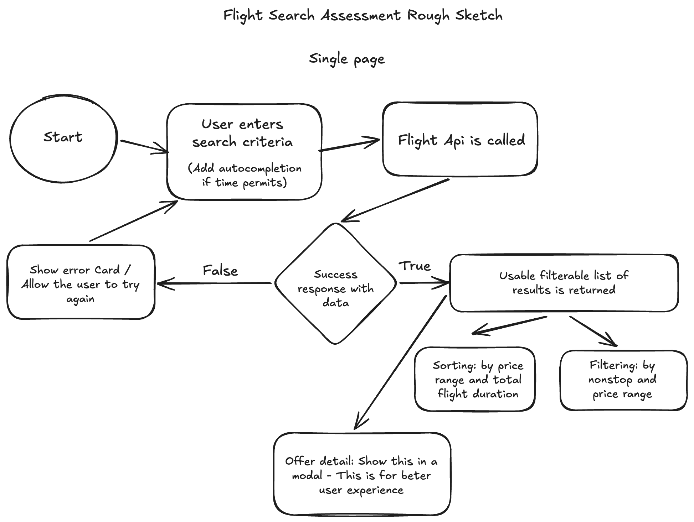

# Journey Mentor Flight Search

A Vue 3 flight-search assessment project for Journey Mentor. The app lets a user search live Duffel sandbox flight offers, review results, filter and sort offers, inspect details, browse nearby departure dates, and use place autocomplete so they do not need to know airport IATA codes upfront.

## Product Sketch

I used a small Excalidraw sketch to think through the main search-to-results flow before implementing the UI.



## Tech Stack

- Vue 3 with Composition API and `<script setup>`
- TypeScript
- Vite
- Tailwind CSS
- Pinia
- Duffel API in sandbox mode

## Running Locally

Install dependencies:

```sh
npm install
```

Create a local environment file:

```sh
cp .env.example .env.local
```

Add your Duffel sandbox token:

```env
VITE_API_FLIGHT_SEARCH=duffel_test_your_token_here
VITE_API_BASE_URL=/api
```

Start the dev server:

```sh
npm run dev
```

Run quality checks:

```sh
npm run lint
npm run build
```

## Environment Variables

`VITE_API_FLIGHT_SEARCH`

The Duffel sandbox access token. This should be supplied locally through `.env.local` and should not be committed.

`VITE_API_BASE_URL`

Defaults to `/api` so browser requests go through the Vite dev proxy.

## CORS Approach

Duffel does not allow direct browser calls. To keep this assessment frontend-focused, the app uses Vite's dev proxy:

```ts
server: {
  proxy: {
    '/api': {
      target: 'https://api.duffel.com',
      changeOrigin: true,
      rewrite: (path) => path.replace(/^\/api/, ''),
    },
  },
}
```

The client calls `/api/...`, and Vite forwards the request to Duffel during local development.

## Implemented Requirements

### Core

- Search form with origin, destination, departure date, optional return date, passenger count, and cabin class.
- Input validation before searching.
- Live offer request integration with Duffel's offer request API.
- Results list with airline, departure and arrival times, total duration, stops, and price.
- Loading, empty, and error states.
- Sorting by price and total duration.
- Filtering by stops and price range.
- Offer detail modal with segments, layovers, fare, and baggage information.
- Nearby departure date window that can refetch results for another departure date.
- Persistence of the current search through local storage and query params. On reload, the app refetches offers instead of replaying stale results.
- Responsive layout from mobile to desktop.

### Bonus

- Debounced origin and destination autocomplete using Duffel's `/places/suggestions` endpoint.
- Sorting by departure time.
- Filtering by departure time.
- Extra filter affordances for checked bags and cabin.

## Architecture

The API integration follows a layered structure:

1. `src/services/endpoints.ts`
2. `src/composables/useFetch.ts`
3. Feature services in `src/services/*`
4. Feature composables in `src/composables/*`
5. Vue components

Components do not call `fetch` directly. Components call feature composables or emit events upward, and the composables/services handle API work.

## State Management

Pinia is used for persisted search state because the current search needs to survive reloads and be shared between the search form, results, query params, and nearby date behavior.

Local component state is still used for UI-only state such as filter modal drafts, active sorting, selected offer modal state, and autocomplete dropdown state.

## TypeScript Decision

TypeScript is used throughout the project because the app depends heavily on API request and response shapes. Duffel offer requests, place suggestions, mapped offer cards, filters, form values, and API error handling are all typed to make the data flow easier to review and safer to change.

## Notable Decisions

- Autocomplete displays friendly place names to users but stores the selected IATA code for the Duffel offer request payload.
- Nearby date selection clears the optional return date before refetching so a selected departure date cannot conflict with an older return date.
- Query params take priority over local storage when both are present, because the URL should represent the user's intended search.
- Results are mapped from Duffel's response into a smaller UI-friendly offer shape before rendering.

## Current Limitations

- Filters are applied client-side after offers are returned.
- The results grid renders all returned offers instead of paginating or virtualizing.
- Loading and error states are intentionally simple.
- Deployment URL should be added here before submission.

## Personal Notes

- [ ] I initially wanted to skip the autocompletion implementation, but I realised quickly that I was getting the `iata` error from the api and it won’t be nice for users to start guessing the iata of every country. Reason I had to implement. Asides from it actually being a bonus - It also contributes to the user experience.
- [ ] What I would have loved to do better is - How the error, loading state is displayed. I could have replaced the loading state with maybe a skeleton and add icon to the error state
- [ ] I am currently applying filters on client side; This limits the application in a lot of ways. Filters are better applied on server side
- [ ] When multiple items are returned, I just dump it on the page; This is not user friendly. What I could have done was add infinite scroll or pagination to make it more user friendly
